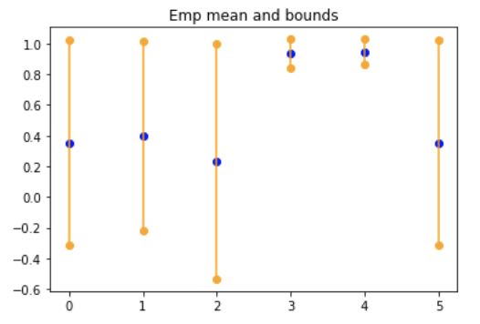
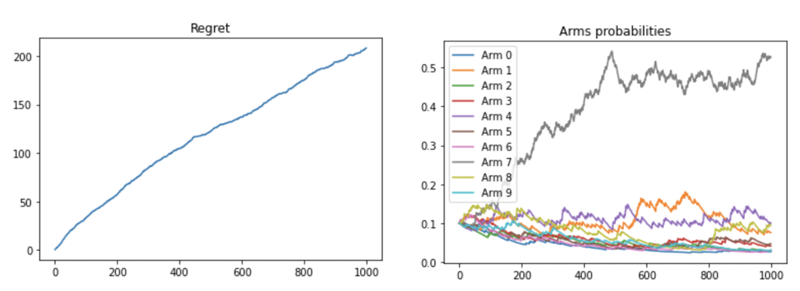
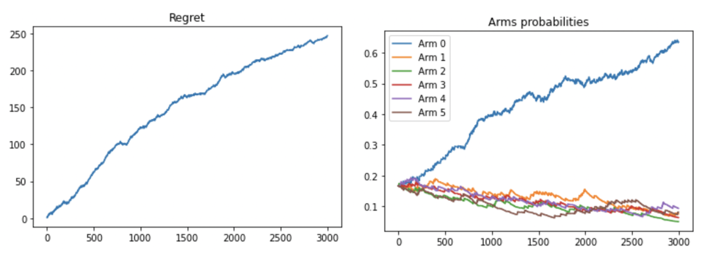

# Some implementation of bandits strategies

* `Available agent strategies:` Stochastic (UCB, EpsilonGreedy), Adversarial (Exp3, Exp3p).
* `Available arms:` Stochastic (Bernouilli, Beta), Adversarial examples (Oblivious, non-oblivious).

## Usage with custom pull_arm function

```python
from bandits.agent.stochastic_agent import UCBAgent

def pull_arm(arm_id: int) -> float:
    """your custom pull arm function"""
    return value

NB_ARMS = 10
agent = UCBAgent(pull_function=pull_arm, number_of_arms=NB_ARMS, horizon=1000, alpha=2)
for k in range(1000):
    agent.play()
agent.plot_knowledge()
```

<p align="center">
  
</p>


## Usage with known stochastic arms

```python
from bandits.arms.stochastic_arms import BetaArms
from bandits.agent.adversarial_agent import Exp3PAgent

arms = BetaArms(number_of_arms=10)
agent = Exp3PAgent(pull_function=arms.pull_arm, number_of_arms=10, horizon=1000)
for k in range(1000):
    agent.play()

agent.plot_knowledge()
agent.plot_regret(arms.get_best_arm_cumul_rewards(horizon=1000), label="exp3p")
```

<p align="center">
  
</p>

## Usage with known adversarial arms

Create oblivious adversarial arms by providing a `reward_pattern_matrix`, and a non-oblivious adversarial arms
by providing a `transition_reward_matrix` and a `proba_reward_matrix`. See the [tests](./tests) for concrete examples.

```python
import numpy as np
from bandits.arms.adversarial_arms import AdversarialObliviousArm
from bandits.agent.adversarial_agent import Exp3PAgent

NB_ARMS = 6

# create a reward pattern and associated arms
a = np.array([0] + list(range(NB_ARMS)))
reward_pattern_matrix = np.eye(NB_ARMS)[a]
arms = AdversarialObliviousArm(number_of_arms=NB_ARMS, horizon=3000, reward_pattern_matrix=reward_pattern_matrix)

# create agent and play
agent = Exp3PAgent(pull_function=arms.pull_arm, number_of_arms=NB_ARMS, horizon=3000)
for k in range(3000):
    agent.play()

agent.plot_knowledge()
agent.plot_regret(arms.get_best_arm_cumul_rewards(horizon=1000), label="exp3p")
```

<p align="center">
  
</p>


## Run tests

```bash
python -m pytest tests
```

## Build package

```
python setup.py bdist_wheel
```

Install the built package

```
pip install /path/to/wheelfile.whl
```